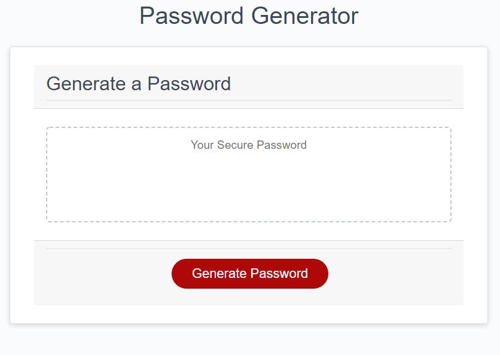

## Password Generator
After days of struggling and blowing up my tutor's slack, the class TA's slack, and the Google bar, I proudly present to you, the Password Generator (lol).

## Summary

In this program, the user will choose between 8 and 128 characters, the user will choose whether or not to include special characters, numbers, lower case and upper case letters then the program will generate a password meeting this criteria.

If the user chooses a character amount less than 8 characters or greater than 128 characters an error message will pop up and the same previous promp will initiate again.

Once the user has passed that step, the user is then given the option to include special characters, numbers, lower case letters, and/or upper case letters. If the user declines all these options then an error message will pop up and the previous prompt will initiate again.

Try it here: https://johnnylieu.github.io/PassGeneratorHW/

## History

https://github.com/johnnylieu/PassGeneratorHW/commits/master

## Screenshot

## Credits
I would like to thank my tutor Bobbi Tarkany and the class TA Steven Landgraf for always being patient and pointing me in the right direction.

I also used https://github.com/jamierachael/Password-Generator/blob/master/script.js as reference.

## License
 
* © 2019 Trilogy Education Services, a 2U, Inc. brand. All Rights Reserved.
* © UCSD Coding Bootcamp